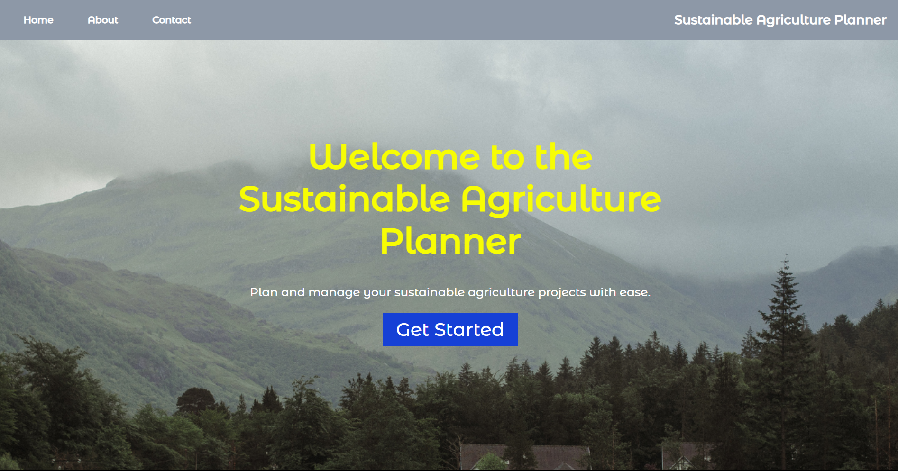

# Sustainable Agriculture Planner

## Introduction
The Sustainable Agriculture Planner is a web-based tool designed to support sustainable farming practices. It provides a comprehensive set of features to assist farmers and stakeholders in planning, managing resources efficiently, and promoting sustainable agricultural development.

## Features
- **Interactive Interface:** User-friendly interface for easy navigation and interaction.
- **Resource Management:** Tools for efficient land use, water management, and crop planning.
- **Data-driven Insights:** Utilizes data analytics to provide valuable insights for decision-making.
- **Case Studies:** Real-world case studies demonstrating the positive impact of sustainable practices.
- **Join Us:** Information on how to contribute and be part of the sustainable agriculture community.

## Demo
https://techbire.github.io/agriculture-html

## Installation
To run the Sustainable Agriculture Planner locally, follow these steps:
1. Clone the repository: `git clone https://github.com/techbire/agriculture-html.git`
2. Navigate to the project directory: `cd agriculture-html`
3. Open `index.html` in your preferred web browser.

## Usage
1. Open the application in your web browser.
2. Explore the different sections, such as "Intro," "Tools," "Roles," "Case Studies," "Conclusion," and "Join Us."
3. Interact with the tools and resources provided for sustainable agriculture planning.
4. Contribute to the project by following the guidelines in the [Contributing](CONTRIBUTING.md) document.

## Technologies Used
- HTML
- CSS
- JavaScript

## Contributing
We welcome contributions from the community. To contribute, please follow the guidelines outlined in the [Contributing](CONTRIBUTING.md) document.

## License
This project is licensed under the [MIT License](LICENSE).

## Acknowledgements
- [List any external libraries, resources, or inspirations]

